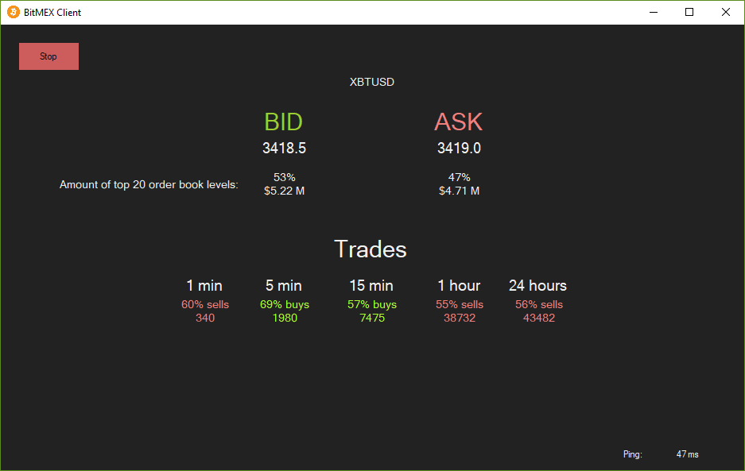

# Bitmex websocket API client [](https://travis-ci.org/Marfusios/bitmex-client-websocket) [](https://badge.fury.io/nu/Bitmex.Client.Websocket)

This is a C# implementation of the Bitmex websocket API found here:

https://www.bitmex.com/app/wsAPI

### License: 
    Apache License 2.0

### Features

* installation via NuGet ([Bitmex.Client.Websocket](https://www.nuget.org/packages/Bitmex.Client.Websocket))
* public and authenticated API
* targeting .NET Standard 2.0 (.NET Core, Linux/MacOS compatible)
* reactive extensions ([Rx.NET](https://github.com/Reactive-Extensions/Rx.NET))
* integrated logging ([Serilog](https://serilog.net/))

### Usage

```csharp
var exitEvent = new ManualResetEvent(false);
var url = Bitmex.ApiWebsocketUrl;

using (var communicator = new BitmexWebsocketCommunicator(url))
{
    using (var client = new BitmexWebsocketClient(communicator))
    {
        client.Streams.InfoStream.Subscribe(info =>
        {
            Console.WriteLine($"Info received, reconnection happened.")
            client.Send(new PingRequest()).Wait();
        });

        client.Streams.PongStream.Subscribe(pong =>
        {
            Console.WriteLine($"Pong received!")
            exitEvent.Set();
        });

        await communicator.Start();

        exitEvent.WaitOne(TimeSpan.FromSeconds(30));
    }
}
```

More usage examples:
* integration tests ([link](test_integration/Bitmex.Client.Websocket.Tests.Integration))
* console sample ([link](test_integration/Bitmex.Client.Websocket.Sample/Program.cs))
* desktop sample ([link](test_integration/Bitmex.Client.Websocket.Sample.WinForms))

### API coverage

| PUBLIC                 |    Covered     |  
|------------------------|:--------------:|
| Info                   |  ✔            |
| Ping-Pong              |  ✔            |
| Errors                 |  ✔            |
| Subscribe              |  ✔            |
| Unsubscribe            |                |
| Announcement           |                |
| Chat                   |                |
| Connected              |                |
| Funding                |                |
| Instrument             |                |
| Insurance              |                |
| Liquidation            |  ✔            |
| Orderbook L2           |  ✔            |
| Orderbook L10          |                |
| Public notifications   |                |
| Quote                  |  ✔            |
| Quote bin 1m           |                |
| Quote bin 5m           |                |
| Quote bin 1h           |                |
| Quote bin 1d           |                |
| Settlement             |                |
| Trade                  |  ✔            |
| Trade bin 1m           |  ✔            |
| Trade bin 5m           |  ✔            |
| Trade bin 1h           |  ✔            |
| Trade bin 1d           |  ✔            |

| AUTHENTICATED          |    Covered     |  
|------------------------|:--------------:|
| Affilate               |                |
| Execution              |                |
| Order                  |  ✔            |
| Margin                 |                |
| Position               |  ✔            |
| Private notifications  |                |
| Transact               |                |
| Wallet                 |  ✔            |

**Pull Requests are welcome!**

### Reconnecting

There is a built-in reconnection which invokes after 1 minute (default) of not receiving any messages from the server. It is possible to configure that timeout via `communicator.ReconnectTimeoutMs`. Also, there is a stream `ReconnectionHappened` which sends information about a type of reconnection. However, if you are subscribed to low rate channels, it is very likely that you will encounter that timeout - higher the timeout to a few minutes or call `PingRequest` by your own every few seconds. 

In the case of Bitmex outage, there is a built-in functionality which slows down reconnection requests (could be configured via `communicator.ErrorReconnectTimeoutMs`, the default is 1 minute).

Beware that you **need to resubscribe to channels** after reconnection happens. You should subscribe to `Streams.InfoStream`, `Streams.AuthenticationStream` and send subscriptions requests (see [#12](https://github.com/Marfusios/bitfinex-client-websocket/issues/12) for example). 

### Backtesting

The library is prepared for backtesting. The dependency between `Client` and `Communicator` is via abstraction `IBitmexCommunicator`. There are two communicator implementations: 
* `BitmexWebsocketCommunicator` - a realtime communication with Bitmex via websocket API.
* `BitmexFileCommunicator` - a simulated communication, raw data are loaded from files and streamed. If you are **interested in buying historical raw data** (trades, order book events), contact me.

Feel free to implement `IBitmexCommunicator` on your own, for example, load raw data from database, cache, etc. 

Usage: 

```csharp
var communicator = new BitmexFileCommunicator();
communicator.FileNames = new[]
{
    "data/bitmex_raw_xbtusd_2018-11-13.txt"
};
communicator.Delimiter = ";;";

var client = new BitmexWebsocketClient(communicator);
client.Streams.TradesStream.Subscribe(response =>
{
    // do something with trade
});

await communicator.Start();
```


### Multi-threading

Observables from Reactive Extensions are single threaded by default. It means that your code inside subscriptions is called synchronously and as soon as the message comes from websocket API. It brings a great advantage of not to worry about synchronization, but if your code takes a longer time to execute it will block the receiving method, buffer the messages and may end up losing messages. For that reason consider to handle messages on the other thread and unblock receiving thread as soon as possible. I've prepared a few examples for you: 

#### Default behavior

Every subscription code is called on a main websocket thread. Every subscription is synchronized together. No parallel execution. It will block the receiving thread. 

```csharp
client
    .Streams
    .TradesStream
    .Subscribe(trade => { code1 });

client
    .Streams
    .BookStream
    .Subscribe(book => { code2 });

// 'code1' and 'code2' are called in a correct order, according to websocket flow
// ----- code1 ----- code1 ----- ----- code1
// ----- ----- code2 ----- code2 code2 -----
```

#### Parallel subscriptions 

Every single subscription code is called on a separate thread. Every single subscription is synchronized, but different subscriptions are called in parallel. 

```csharp
client
    .Streams
    .TradesStream
    .ObserveOn(TaskPoolScheduler.Default)
    .Subscribe(trade => { code1 });

client
    .Streams
    .BookStream
    .ObserveOn(TaskPoolScheduler.Default)
    .Subscribe(book => { code2 });

// 'code1' and 'code2' are called in parallel, do not follow websocket flow
// ----- code1 ----- code1 ----- code1 -----
// ----- code2 code2 ----- code2 code2 code2
```

 #### Parallel subscriptions with synchronization

In case you want to run your subscription code on the separate thread but still want to follow websocket flow through every subscription, use synchronization with gates: 

```csharp
private static readonly object GATE1 = new object();
client
    .Streams
    .TradesStream
    .ObserveOn(TaskPoolScheduler.Default)
    .Synchronize(GATE1)
    .Subscribe(trade => { code1 });

client
    .Streams
    .BookStream
    .ObserveOn(TaskPoolScheduler.Default)
    .Synchronize(GATE1)
    .Subscribe(book => { code2 });

// 'code1' and 'code2' are called concurrently and follow websocket flow
// ----- code1 ----- code1 ----- ----- code1
// ----- ----- code2 ----- code2 code2 ----
```

#### Desktop application (WinForms or WPF)

Due to the large amount of questions about integration of this library into a desktop application (old full .NET Framework), I've prepared WinForms example ([link](test_integration/Bitmex.Client.Websocket.Sample.WinForms)). 



### Available for help
I do consulting, please don't hesitate to contact me if you have a custom solution you would like me to implement ([web](http://mkotas.cz/), 
<m@mkotas.cz>)

Donations gratefully accepted.
* [](https://en.cryptobadges.io/donate/1HfxKZhvm68qK3gE8bJAdDBWkcZ2AFs9pw)
* [](https://en.cryptobadges.io/donate/LftdENE8DTbLpV6RZLKLdzYzVU82E6dz4W)
* [](https://en.cryptobadges.io/donate/0xb9637c56b307f24372cdcebd208c0679d4e48a47)
